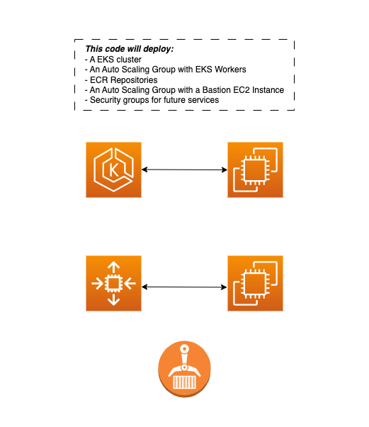

# Terraform EKS, ECR and EC2 Bastion

With this template will deploy a complete project with all the necessary components for its operation.
 Customize the project, you can remove modules like the "asg-bastion" module if necessary. 

## Structure
The main structure is:
| Name | Description |
|:------|-------------|
| [datasources.tf](datasources.tf) | Data sources that import the VPC, Subnets and AMIs |
| [main.tf](main.tf) | Building AWS modules |
| [variables.tf](variables.tf) | Writable file for the project |
| [provider.tf](provider.tf) | AWS provider, Terraform state, S3 bucket backend for storing Terraform remote state |
#### Important (before initial "terraform apply")
The generated [.tfstate](provider.tf) is not stored in the remote state S3 bucket. Make sure the base [.tfstate](provider.tf) is registered in your infrastructure repository. You will have to modify this if you want to store it.

## Modified documents
In the file "variables.tf" you find everything that the variables modify.
| Variable name | Description | Optional |
|:------|-------------|:----:|
| General | General settings |  |
| [project_name](variables.tf) | Indicates the name of the project |  |
| [vpc_name](variables.tf) | Existing vpc name |  |
| [subnet_private_cidr](variables.tf) | CIDR of existing private subnets |  |
| [subnet_isolated_cidr](variables.tf) | CIDR of existing isolated subnets |  |
| [keypair](variables.tf) | Keypair already created |  |
| Bastion | EC2 instance bastion module | Yes |
| [instance_type_bastion](variables.tf) | Instance type bastion |  |
| [desired_capacity](variables.tf) | ASG desired capacity (min - max) |  |
| Eks | EKS module |  |
| [cluster_version](variables.tf) | EKS cluster version |  |
| [instance_type_eks](variables.tf) | Instance type eks |  |
| [amount_workers](variables.tf) | ASG desired capacity (min - max) |  |
| Ecr | ECR module | Yes |
| [repositorie_name1](variables.tf) | ECR repository name 1 | Yes |
| [repositorie_name2](variables.tf) | ECR repository name 2 | Yes |
| [repositorie_name3](variables.tf) | ECR repository name 3 | Yes |

## Changes after deploying infrastructure
#Re-Tag Workers
aws autoscaling create-or-update-tags     --tags ResourceId="(ASG_NAME)",ResourceType="auto-scaling-group",Key="Name",Value="Ec2Workers(PROJECT_NAME)",PropagateAtLaunch=True

- Terminate unnamed instances
aws autoscaling describe-auto-scaling-instances
aws autoscaling terminate-instance-in-auto-scaling-group     --instance-id (ID_INSTANCE)     --no-should-decrement-desired-capacity

#Configure AuthMap (If admin access is required)
- AWS Login: aws configure
- Install Kubectl: https://docs.aws.amazon.com/eks/latest/userguide/install-kubectl.html
- aws eks update-kubeconfig --name (EKS_CLUSTER_NAME)
- kubectl -n kube-system edit configmap aws-auth

  mapUsers: |
    - userarn: USER_ARN
      username: USERNAME
      groups:
        - system:masters

## About me
https://github.com/sebaswk